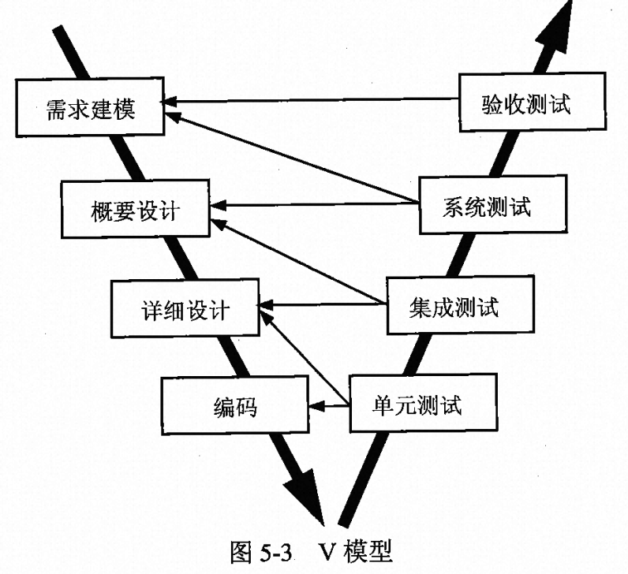
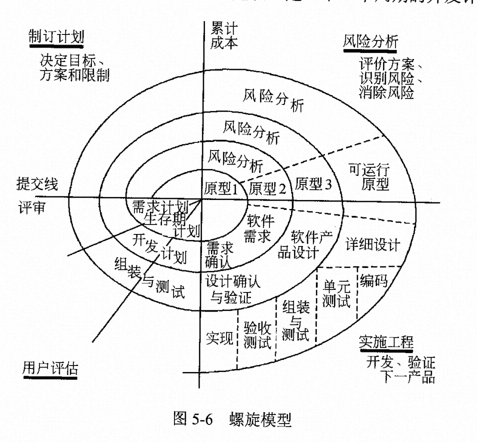
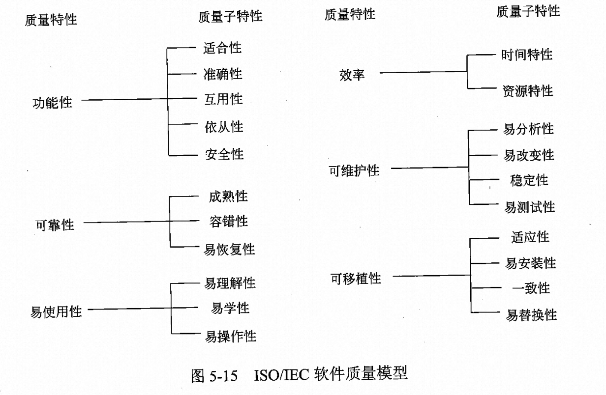
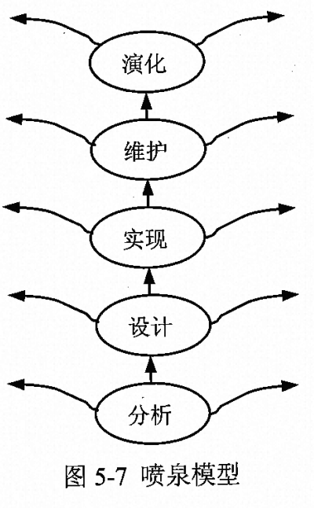

# 软件工程概述

计算机软件： 计算机系统中的程序及其文档。

程序：计算任务的处理对象和处理规则的描述。

计算任务： 任何以计算机为处理工具的任务

处理对象： 数据（如数字，文字，图形，图像，声音等，只是表示而无含义）或信息（数据及有关的含义）。

处理规则： 一般指处理的动作和步骤。

文档：为了便于了解程序所需的阐述性资料。

## 计算机软件的分类

1. 系统软件
2. 应用软件
3. 工程/科学软件
4. 嵌入式软件
5. 产品线软件
6. web应用
7. 人工智能软件
8. 开放计算
9. 网络资源
10. 开源软件

## 软件工程基本原理

确保软件产品质量和开发效率的原理的最小合集

1. 用分阶段的生命周期计划严格管理（6类计划）
      * 项目概要计划
      * 里程碑计划
      * 项目控制计划
      * 产品控制计划
      * 验证计划
      * 运行维护计划
2. 坚持进行阶段评审（每个阶段都应严格的评审，早点发现问题）
3. 实现严格的产品控制 （需求发生变化）
     * 基准配置管理（变动控制）经过阶段评审后的软件配置成分。一切关于修改软件的建议都要进行严格的规程进行评审，批准后才能实施修改。
     * 基准配置（基线配置）
4. 采用现代程序设计技术（用先进的技术既可以提高软件开发效率，又能降低软件维护的成本）
5. 结果应能清楚地审查（明确规定开发小组的责任和产品标准）
6. 开发小组的人员应少而精（少：通信开销会减少， 精：开发效率高）
7. 承认不断改进软件工程实践的必要性（对项目进行总结，收集进度）

## 软件生存周期

软件生存周期：

1. 可行性分析与项目开发计划（确定软件的开发目标及其可行性）（产生可行性分析报告和项目开发计划）
2. 需求分析（明确软件系统必须做什么，确定软件的功能、性能、数据和界面要求，确认系统的逻辑模型）（产生软件需求说明书）
3. 概要设计（把确定的各项功能需求转换成需要的体系结构，设计软件的结构，明确软件的模块，设计数据结构和数据库结构，数据之间的关系，主要是模块之间的外部关系）（产生概要设计说明书）
4. 详细设计（对每个模块完成的功能进行具体描述，模块详细的逻辑，模块内部）（产生详细设计文档）
5. 编码（把每个模块的控制结构转换成计算机可接受的程序代码）
6. 测试（在设计测试用例的基础上检查软件的各个组成部分）（产生软件测试计划，测试用例和软件测试报告）
7. 维护（生存周期中最长的阶段）

## 软件过程

含义：

1. 个体含义（指软件产品或系统在生存周期中的某一类活动的集合，如软件开发过程，软件管理过程等）
2. 整体含义（指软件产品或系统在所有上述含义下的软件过程的总体）
3. 工程含义（指解决软件过程的工程，应用软件的原则、方法来构造软件过程模型，并结合软件产品的具体要求进行实例化，以及在用户环境下的运作，以此进一步提高软件的生产率，降低成本）

### 能力成熟度模型（CMM）

CMM - 软件过程能力成熟度模型。是对软件组织进化阶段的描述，随着软件组织定义、试试、测量、控制和改进其软件过程，软件组织的能力经过这些阶段逐步提高。能稳步地改善软件全组织的软件过程，使全组织的额软件过程能力持续增长。

5个成熟度级别

1. 初始级（软件过程的特点是杂乱无章，有事甚至很混乱，几乎没有明确定义的步骤，项目成功完全依赖个人的努力和英雄式核心人物的作用）
2. 可重复级（建立了基本的项目管理过程和实践来跟踪项目费用、进度和功能特性，有必要的过程准则来重复以前在同类项目中的成功）
3. 已定义级（管理和工程两方面的软件过程已经文档化、标准化，并综合成整个项目开发组织的标准软件过程。所有项目都采用根据实际情况修改后得到的标准软件过程来开发和维护软件）
4. 已管理级（制定了软件过程和产品质量的详细度量标准。软件过程的产品质量都被开发组织的成员所理解和控制）
5. 优化级（加强了定量分析，通过来自过程质量反馈和来自新观念、新技术的反馈是过程能不断持续地改进）

### CMMI （Capability Maturity Model Integration）- 能力成熟度模型集成

是若干过程模型的综合个改进，是支持多个工程学科和领域的、系统的、一致的过程改进框架，能适应现代工程的特点和需要，能提高过程的质量和工作效率。

两种表示方法：

1. 阶段式模型 （结构类似CMM，它关注组织的成熟度，当组织满足过程域的特定目标和共性目标时，就说该组织达到了那个过程域的能力等级）

    * 初始的（过程不可预测且缺乏控制）
    * 已管理的（过程为项目服务）
    * 已定义的（过程为组织服务）
    * 定量管理的（过程已度量和控制）
    * 优化的（集中于过程改进）

2. 连续式模型 （关注每个过程域的能力）

能力等级包括共性目标及相关的共性实践，这些实践在过程域内被添加到特定目标和实践中。

* CL0（未完成的）：过程域未执行或未得到CL1中定义的所有目标
* CL1（已执行的）：其共性目标是过程将可标识的输入工作产品转换成可标识的输出工作产品，以实现支持过程域的特定目标
* CL2（已管理的）：其共性目标集中于已管理的过程的制度化。根据组织级政策规定过程的运作将使用哪个过程，项目遵循已文档化的计划和过程描述，所有正在工作的人都有权使用足够的资源，所有工作任务和工作产品都被监控、控制和评审。
* CL3（已定义级的）：其共性目标集中于已定义的过程的制度化。过程是按照组织的剪裁指南从组织的标准过程集中剪裁得到的，还必须手机过程资产和过程的度量，并用于将来对过程的改进。
* CL4（定量管理的）：其共性目标集中于可定量管理的过程的制度化。使用测量和质量保证来控制和改进过程域，建立和使用关于质量和过程执行的定量目标作为管理准则。
* CL5（优化的）：使用量化（统计学）手段改变和优化过程域，以满足客户要求的改变和持续改进计划中的过程域的功效

# 软件过程模型

也叫软件开发模型，它是软件开发全部过程、活动和任务的结构框架。

经典模型

* 瀑布模型
* 增量模型
* 演化模型（原型模型，螺旋模型）
* 喷泉模型
* 基于构件的开发模型
* 形式化方法模型

## 瀑布模型

将软件生存周期中的各个活动规定为线性顺序连接的若干阶段的模型，包括需求分析、设计、编码、测试、运行与维护。它规定了由前至后、相互衔接的固定次序，如同瀑布流水逐级向下。
以文档为驱动，适合软件需求很明确的软件项目的模型。

优点：

1. 容易理解，管理成本低
2. 强调开发的阶段性早起计划及需求调查和产品测试。

不足：

1. 客户必须能够完整、正确和清晰地表达他们的需要
2. 在开始的2-3个阶段中很难评估真正的进度状态
3. 当接近项目结束时，出现大量的集成和测试工作。
4. 直到项目结束之前，都不能演示系统的能力。
5. 需求或设计中的错误往往只有到了项目的后期才能被发现，对项目风险的控制能力较弱，从而导致项目尝尝延期完成，超出预算。

V模型

描述了质量保证活动和沟通、建模相关活动以及早起构件相关的活动之间的关系。

随着软件团队工作沿着V模型左侧步骤乡下推进，基本问题需求逐步细化。一旦编码结束，团队沿着右侧向上推进工作，实际上执行了一系列的测试。

<!--  -->

## 增量模型

融合了瀑布模型的基本成分和原型实现的迭代特征，它假设可以将需求分段为一系列增量产品，每一增量可以分别开发。该模型采用随着日程时间的进展而交错的线性序列，每个线性序列产生软件的一个可发布的增量。

优点：

1. 有瀑布模型的所有优点
2. 第一个可交付版本所需要的成本和时间很少
3. 开发由增量表示的小系统所承担的风险不大
4. 减少用户需求的变更
5. 运行增量投资，即项目开始时，可以仅对一个或两个增量投资

不足：

1. 如果没有对用户的变更要求进行规划，那么产生的初始增量可能造成后来增量的不稳定
2. 如果需求不像早期思考的那样完整和稳定，那么一些增量就可能需要重新开发，重新发布
3. 管理发生的成本、进度和配置分复杂性可能超出组织的能力

## 演化模型

演化模型是迭代的过程模型，是的软件开发人员能够逐步开发出更完整的软件版本。演化模型特别适合对软件需求缺乏准确认识的情况。

### 原型模型

原型模型比较适合于用户需求不请、需求经常变化的情况。当系统不大也不太复杂时，采用这个方法比较好。

原型模型开始于沟通，其目的是定义软件的总体目标，标识需求，然后快速制定原型的开发计划，确定原型的目标和范围，采用快速设计的方式对其进行建模，并构建原型。被开发的原型应交付客户使用，并收集客户的反馈信息，这些反馈意见可在下一轮中对原型进行改进。在前一个原型需要改进，或者需要扩展其范围的时候，进入下一轮原型的迭代开发。

分类：

1. 探索型原型
2. 实验型原型
3. 演化型原型

### 螺旋模型

将瀑布模型和演化模型结合起来，加入了两种模型均忽略的风险分析，弥补了这两种模型的不足。

<!--  -->

每个周期分为4个步骤：

1. 制定计划。确定软件目标，选定实施方案，明确项目开发的限制条件。
2. 风险分析。分析所选的方案，识别风险，消除风险。
3. 实施工程。实施软件开发，验证阶段性产品。
4. 用户评估。评价开发工作，提出修正建议，建立下一个周期的开发计划。

螺旋模型强调风险分析，使得开发人员和用户对每个演化层出现的风险有所了解，从而做出应有的反应。因此，该模型特别适用于庞大，复杂且具有高风险的系统。

## 喷泉模型

是一种以用户需求为动力，已对象作为驱动的模型，适合于面向对象的开发方式。克服了瀑布模型不支持软件重用和多项开发活动集成的局限性。允许各开发活动交叉、迭代地运行。

<!--  -->

优点：

可以提高软件的开发效率，节省开发时间。 允许各种开发活动交叉、迭代地进行。各个阶段没有明显的界限，开发人员可同步进行。

缺点：

由于喷泉模型在各个开发阶段是重叠的，在开发过程需要大量的开发人员，不利于项目的管理。要求严格管理文档，使审核的难度加大。

## 基于构件的开发模型 （类似于包开发，然后项目中引入包的形式）

定义：指利用预先包装的构件来构造应用系统。构件可以是组织内部开发的构件，也可以是产品化成品软件构件。

它本质上是演化模型，需要以迭代方式构建软件。不同之处在于，基于构件的开发模型采用预先打包的软件构件开发应用系统。

包含两部分：

1. 领域工程
2. 应用工程

## 形式化方法模型

生成计算机软件形式化的数学规格说明。

## 统一过程(UP)模型

定义：是一种“用例和风险驱动，以架构为中心，迭代并且增量”的开发过程，由UML方法和工具支持。迭代的意思是将整个软件开发项目划分为许多个小的“袖珍项目”，每个项目都包含正常软件项目的所有元素：计划、分析和设计、构造、集成和测试，以及内外部发布。

4个技术阶段：

1. 起始阶段：专注于项目的初创活动，主要工作产品：构想文档，初始用例模型，初始项目术语表，初始业务用例，初始风险评估，项目计划（阶段及迭代），业务模型，一个或多个原型（需要时）
2. 精化阶段：在理解了最初的领域范围之后进行需求分析和架构演进。主要工作产品：用例模型，补充需求，分析模型，软件体系结构描述，可执行的软件体系结构原型，初步的设计模型，修订的风险列表，项目计划（包括迭代计划、调整的工作流、里程碑和技术工作产品），初始用户手册
3. 构建阶段：关注系统的构建，产生实现模型。主要工作产品：设计模型，软件构件，集成的软件增量，测试计划及步骤，测试用例，支持文档（用户手册、安装手册和对于并发增量的描述）
4. 移交阶段：关注软件提交方面的工作，产生软件增量。主要工作产品：提交的软件增量，β测试报告，综合用户反馈。

每个迭代中有5个核心工作流：

1. 捕获系统应该做什么的需求工作流
2. 精化和结构化需求的分析工作流
3. 在系统构架内实现需求的设计工作流
4. 构造软件的实现工作流
5. 验证实现是否如期望那样工作的测试工作流

随着UP的阶段进展，每个核心工作流的工作量发生了变化。
4个技术阶段由主要里程碑所终止：

1. 初始阶段：生命周期目标
2. 精化阶段：生命周期架构
3. 构建阶段：初始运作功能
4. 移交阶段：产品发布

RUP是UP的商业扩展，完全兼容UP，但比UP更完整、更详细

## 敏捷方法

总体目标：尽可能早地、持续地对有价值的软件的交付

通过在软件开发过程中加入灵活性，敏捷方法使用户能够在开发周期的后期增加或改变需求。

敏捷宣言：敏捷过程的每一种方法基于一套原则，这些原则实现了敏捷方法所宣称的理念。

1. 极限编程（XP）（****）：XP是一种轻量级（敏捷）、高效、低风险、柔性、可预测的、科学的软件开发方式。它有价值观、原则、实践和行为4个部分组成，彼此相互依赖、关联，并通过行为贯穿整个生存周期

1. 4大价值观：沟通、简单性、反馈、勇气
2. 5个原则： 快速反馈、简单性假设、逐步修改、提倡更改、优质工作
3. 12个最佳实践：

* 计划游戏（快速制定计划、随着细节的不断变化而完善，用户直接参与）
* 小型发布（系统的设计要能够尽可能早地交付）
* 隐喻（找到合适的比喻传达信息）
* 简单设计（只处理当前的需求，使设计保持简单）
* 测试先行（先写测试代码，然后编写程序）
* 重构（重新审视需求和设计，重新明确地描述他们以符合新的和现有的需求）
* 结对编程
* 集体代码所有制
* 持续集成（可以按日甚至按小时为客户提供可运行的版本）
* 每周工作40小时
* 现场客户
* 编码标准

2. 水晶法（Crystal）

水晶法认为每个不同的项目都需要一套不同的策略、约定和方法论，认为人对软件质量有重要的影响，因此随着项目质量和开发人员素质的提高，项目和过程的质量也随之提高。通过更好的交流和经常性的交付，软件生产力得到提高。

3. 并列争球法（Scrum）

并列争球法使用迭代的方法，其中，把每30天一次的迭代称为一个冲刺，并按需求的优先级别来实现产品。多个自组织和自治的小组并行地递增实现产品。协调是通过简短的日常情况会议来新型，就像橄榄球中俄“并列争球”

4. 自适应软件开发（ASD）

6个原则：

1. 有一个使命作为指导
2. 特征被视为客户价值的关键点
3. 过程中的等待是很重要的，因此“重做”与“做”同样关键
4. 变化不被视为改正，而是被视为对软件开发实际情况的调整。
5. 确定的交付时间迫使开发人员认真考虑每个生产版本的关键需求。
6. 风险也包含其中

5. 敏捷统一过程（AUP）

敏捷统一过程（Aglie Unified Process），采用“在大型上连续”以及“在小型上迭代”的原理来构建软件系统。采用经典的UP阶段性活动（初始，精化，构件和转换），提供了一系列活动，能够使团队维度案件项目构想出一个全面的过程流。在每个活动里，一个团队迭代使用敏捷，并将有意义的软件增量尽可能快地交付给最终用户。

每个AUP迭代执行以下活动：

1. 建模：建立对商业和问题域的模型表述，这些模型“足够好”即可，以便团队继续前进
2. 实现：将模型翻译成源码
3. 测试：相XP一样，团队设计和执行一系列的测试来发现错误以保证源代码满足需求
4. 部署：对软件增量的交付以及获取最终用户的反馈
5. 配置及项目管理：着眼于变更管理、风险管理以及对团队的任一制品的控制。项目管理追踪和控制开发团队的工作进展并协调团队活动
6. 环境管理：协调标准、工具以及适用于开发团队的支持技术等过程基础设施

## 常见习题解

常见的软件生存周期模型有瀑布模型、演化模型、螺旋模型、喷泉模型等。

* 瀑布模型是将软件生存周期各个活动规定为依线性顺序连接的若干阶段的模型，适合于软件需求很明确的软件项目的模型。
* V模型是瀑布模型的一种演变模型，将测试和分析与设计关联进行，加强分析与设计的验证。
* 原型模型是一种演化模型，通过快速构建可运行的原型系统，然后根据运行过程中获取的用户反馈进行改进。
* 演化模型特别适用于对软件需求缺乏准确认识的情况。
* 螺旋模型将瀑布模型和演化模型结合起来，加入了两种模型均忽略的风险分析。

域名解析流程：

1. 客户机提出域名解析请求，并将该请求发送给本地的域名服务器。
2. 当本地的域名服务器收到请求后，就先查询本地的缓存，如果有该纪录项,则本地的域名服务器就直接把查询的结果返回。
3. 如果本地的缓存中没有该纪录，则本地域名服务器就直接把请求发给根域名服务器，然后根域名服务器再返回给本地域名服务器一个所查询域（根的子域）的主域名服务器的地址。
4. 本地服务器再向上一步返回的域名服务器发送请求，然后接受请求的服务器查询自己的缓存，如果没有该纪录，则返回相关的下级的域名服务器的地址。
5. 重复第四步，直到找到正确的纪录。6.本地域名服务器把返回的结果保存到缓存，以备下一次使用,同时还将结果返回给客户机。

本题考查成熟度等级 在CMM的不同等级有不同的核心。

1. 在可重复级，建立了基本的项目管理过程和实践来跟踪项目费用、进度和功能特性。
2. 在已定义级，所有项目都采用根据实际情况修改后得到的标准软件过程来开发和维护软件。
3. 在已管理级，收集对软件过程和产品质量的详细度量，对软件过程和产品都有定量的理解与控制。
4. 在优化级，过程的量化反馈和先进的新思想、新技术促使过程不断改进。
